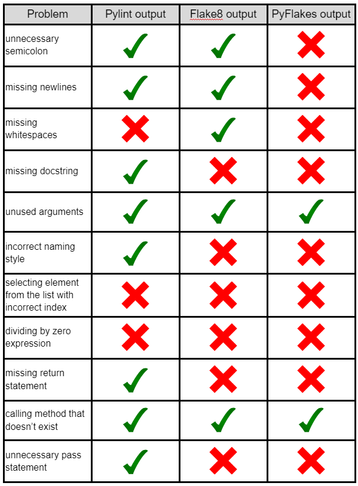
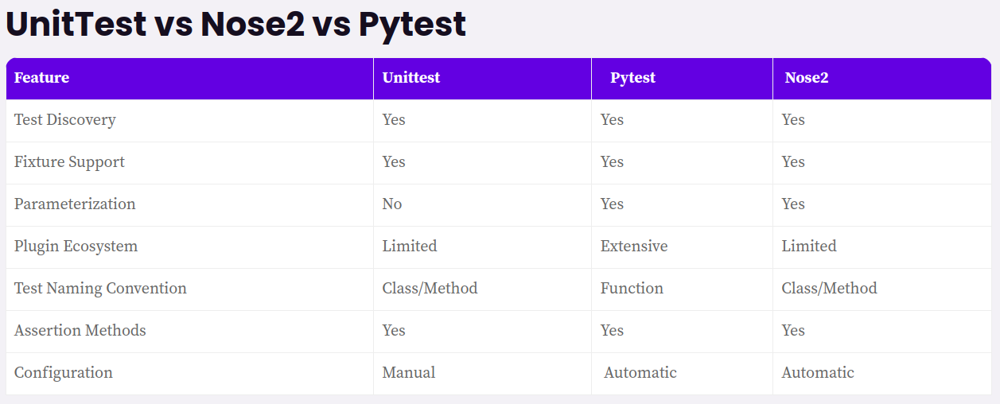

# Best Practices Automation with Python

## 1. Python libraries and framework selection

When selecting a Python library, consider the following factors:

* Test and choose a library or framework for a specific need.
* Choose a suitable library or framework based on the experience of your team.

### Example:
when you select a library/tool always try the options and compare the features
### pylint | flake8 | Pyflakes

### unittest | pytest | nose2

## 2. Object-oriented programming
OOP is a programming paradigm that uses objects and classes to organize and structure code.
This structure helps simplify code complexity and reduce errors.

## 3. Error handling and exception handling
* Use comments to explain your code.
* Modularize your code using functions.
* Use the try-except statement to catch and handle exceptions.
* Use the logging module to log errors and exceptions.

## 4. Documentation
* Write clear comments for your code.
* Use Python docstrings to explain complex code.
* Share your documentation with others.
* Update your code for any applied changes.

## 5. Testing and validation

* Use a testing framework.
* Use a CI/CD pipeline.
* Write unit tests.
* Write integration tests.
.

## 6. Version control and code management

* **Create meaningful names**. Choose descriptive names for your classes, variables and methods.
* **Choose a consistent coding style**. Consistency makes the code easier to read and maintain. The Python style guide, Python Enhancement Proposal 8, can help.
* **Use modules and packages to organize code**. Modules make it easier to read, maintain and reuse code.
* **Use libraries to simplify your work**. A lot of Python libraries are available, and you can choose whichever one suits your needs.

## 7. Reporting
TRy different output formats HTML, XML, JSON

## Advantages of Using Python for Test Automation

### Easy to Learn and Use

Python is an easy language to learn, with a simple syntax. It is also suitable for beginners, as it requires minimal coding knowledge. As a result, you can create automated tests quickly and easily.

### Large Community and Support

With Python’s large and vibrant community, support and guidance are always available. You can find answers on coding forums or websites offering tutorials.

### Wide Range of Libraries and Frameworks

Python has many libraries, from web development to artificial intelligence. Developers will find it easy to choose the suitable library for their needs. Frameworks like Selenium and PyTest make test automation easier using pre-built methods.

### Cross-Platform Compatibility

Python code works across platforms. Creating automated tests on Windows, Mac, and Linux systems is easy. It means your tests can run on any platform without additional coding.

### Automated Testing

With Python, you can automate tests and run them on a regular schedule. It lets you focus on other tasks while your tests run without manually monitoring progress.

## Disadvantages of Using Python for Test Automation

### Slower Execution Speed
As an interpreted language, Python takes more time to execute tests than compiled languages like Java. As a result, running automated tests can take longer than expected.

### Steep Learning Curve for Advanced Features

Python has many advanced features, but these require a deep understanding of the language. It means developers can take time to master test automation with Python.

### Lack of Built-in Support for GUI Testing

Python doesn’t have built-in support for GUI testing. As a result, developers must use libraries like Selenium or PyAutoGUI to automate tests on the UI.

### Limited Support for Mobile Automation

Python has little support for mobile automation. It is suitable only for Android and requires additional coding to run tests on iOS devices.

### Maintenance and Debugging

Python code can sometimes be difficult to maintain and debug. The maintenance and debugging challenges are not inherent to Python but may arise from complex test frameworks and automation code.

### Integration With Other Tools

Python lacks advanced integration with other test management tools. Developers must use other libraries like Jenkins or TestRail to integrate the tests into their projects.

# TIPS

## Knows the API
Understand the API making Exploratory Testing using curl or some other tool

## Document all process
Document all the process, curl examples, postman requests, etc.

## Implement CRUD
Try to implement the basic CRUD for 1 endpoint, so the rest of endpoints will be easier to implement

## Use the correct IDE
Combine the power of IDE and the terminal (shell)

# Q&A
